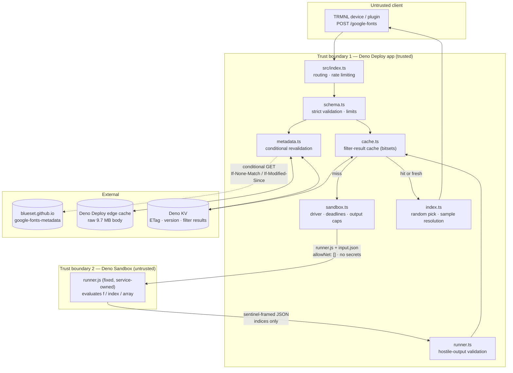

# `POST /google-fonts`

Backs the **Random Google Fonts** TRMNL plugin. It moves the heavy and dangerous parts of the plugin
off the device and out of the browser:

| Was                                                    | Now                                           |
| ------------------------------------------------------ | --------------------------------------------- |
| Device downloads ~9.7 MB of metadata on every refresh  | Server caches it and revalidates once a day   |
| `transform.js` ran the user's filter through `eval`    | Evaluated in an isolated Deno Sandbox microVM |
| `shared.liquid` ran override conditions through `eval` | Resolved server-side into plain strings       |
| Random font chosen in browser JavaScript               | Chosen in the trusted server process          |

Source metadata: <https://blueset.github.io/google-fonts-metadata/metadata.json> (~9.7 MB, ~2,020
fonts, rarely changed, serves `ETag` and `Last-Modified`).

---

## Architecture

This endpoint owns the service's only sandbox usage, and therefore its second trust boundary.
User-supplied JavaScript never runs in the trusted process, and everything the sandbox returns is
re-validated before it is used.



### Files

| File                       | Responsibility                                     |
| -------------------------- | -------------------------------------------------- |
| `index.ts`                 | Orchestration, random selection, sample resolution |
| `schema.ts`                | Request validation and limits                      |
| `metadata.ts`              | Three-tier metadata cache and revalidation         |
| `cache.ts`                 | KV/edge stores, bitset codec, filter-result cache  |
| `sandbox.ts`               | `SandboxDriver` interface and `DenoSandboxDriver`  |
| `runner.ts`                | Trusted-side validation of guest output            |
| `runner/program-source.ts` | The untrusted runner, held as data                 |
| `types.ts`                 | Shared types                                       |

---

## Request

`Content-Type: application/json` is required. Maximum body size is 16 KiB.

```jsonc
{
  // Optional. A JavaScript expression evaluated per font.
  // Empty or omitted means "all fonts".
  "filter": "f.primary_language.endsWith('Latn')",

  // Optional. Object, or a JSON-encoded string (see TRMNL integration).
  "override": {
    "large": [["f.axes?.length > 0", "Variable font sample"]],
    "small": []
  }
}
```

The selection expression receives `f` (current font metadata), `index` (current index) and `array`
(the complete font array), exactly as the original plugin did. Override conditions receive the same
bindings; the plugin's documented contract only promises `f`.

### Limits

| Limit                     | Value  |
| ------------------------- | ------ |
| Request body              | 16 KiB |
| Expression length         | 2,000  |
| Override rules per bucket | 20     |
| Sample-text length        | 2,000  |
| Body nesting depth        | 6      |

Unknown or malformed fields are rejected, never silently ignored.

---

## Response

```ts
interface GoogleFontsResponse {
  font: FontMetadata; // the randomly selected $.fonts[] entry
  sampleText: unknown; // resolved sample-text object
  script: unknown; // data.scripts[font.primary_script]
  axes: unknown; // data.axes
  sampleOverrides: {
    large: string | null; // already-resolved override text, or null
    small: string | null;
  };
  metadataVersion: string;
  errors: string[]; // non-fatal warnings, e.g. stale metadata
}
```

Response headers:

| Header               | Meaning                                                  |
| -------------------- | -------------------------------------------------------- |
| `Cache-Control`      | Always `no-store, max-age=0` — the body is a random draw |
| `ETag`               | Weak, content-derived                                    |
| `X-Metadata-Version` | Current metadata version                                 |
| `X-Metadata-Cache`   | `hot` · `warm` · `revalidated` · `refreshed` · `stale`   |
| `X-Filter-Cache`     | `hit` · `miss`                                           |
| `X-Candidate-Count`  | Number of fonts matching the filter                      |

### Example

```bash
curl -sS https://trmnl-deno-deploy.1a23.deno.net/google-fonts \
  -H 'content-type: application/json' \
  -d '{"filter":"f.qualities?.some(q => q.quality == \"Pixel\")"}'
```

### Errors

Uses the service-wide envelope (see the [root README](../../README.md#error-envelope)). Endpoint
specific codes:

| Status | Code                   | Cause                                           |
| ------ | ---------------------- | ----------------------------------------------- |
| 400    | `invalid_override`     | Malformed override shape                        |
| 422    | `invalid_filter`       | Filter threw or failed to parse                 |
| 422    | `invalid_override`     | An override condition failed                    |
| 422    | `no_font_matched`      | Filter matched zero fonts                       |
| 422    | `evaluation_failed`    | Sandbox timeout, oversized or malformed output  |
| 500    | `metadata_incomplete`  | `en_Latn` fallback sample text missing upstream |
| 503    | `metadata_unavailable` | Upstream down and nothing cached                |
| 503    | `service_busy`         | Sandbox concurrency exhausted (retryable)       |
| 503    | `evaluation_failed`    | Sandbox provisioning problem (retryable)        |

> **Behaviour change vs. the current plugin.** `transform.js` swallowed a broken filter and silently
> fell back to _all_ fonts. This API returns an explicit `422` instead, so a typo is visible rather
> than silently ignored.

---

## Caching design

### Metadata

Three tiers, because Deno KV caps a single value at **64 KiB** — nowhere near enough for the
document:

1. **Hot** — the parsed object held in the isolate. Zero I/O.
2. **Edge** — the raw body in the Deno Deploy Web Cache API (`caches.open`). Lets a cold isolate
   start without touching upstream.
3. **Deno KV** — small revalidation state only: `etag`, `lastModified`, `revalidatedAt`, `version`,
   `byteLength`.

Revalidation runs at most once per 24 h (`METADATA_REVALIDATE_SECONDS`) using `If-None-Match` and
`If-Modified-Since`:

| Upstream               | Behaviour                                                                    |
| ---------------------- | ---------------------------------------------------------------------------- |
| `304 Not Modified`     | Keep the cached body, bump `revalidatedAt` (`X-Metadata-Cache: revalidated`) |
| `200 OK`               | Validate the shape, replace body + state, log the version change             |
| Failure, cache present | Serve stale, log `metadata.upstream_failure`, back off 5 min                 |
| Failure, no cache      | Explicit `503 metadata_unavailable`                                          |

Concurrent callers share **one** in-flight refresh, so there is no stampede, and the 9.7 MB document
is never fetched or parsed per request.

### Filter results

The cache key is `SHA-256("v1|" + metadataVersion + "|" + canonicalRequest)`. Raw expressions never
appear in a storage key, and a metadata change invalidates every entry implicitly.

Values store `EvaluatedFilterResult` as **base64 bitsets** rather than index arrays — a full
2,020-font candidate set is ~340 bytes instead of ~12 KB, which keeps even the largest realistic
entry comfortably inside the 64 KiB KV limit.

- Successful evaluations: 6 h TTL.
- Deterministic failures (bad expression, timeout): 60 s TTL, so a broken plugin configuration
  cannot be used to spam sandbox creation.
- Transient infrastructure failures: **never** cached, returned as `503`.

Every cached and freshly returned index is re-validated against the current font count, checked for
duplicates and capped in total size before use. The random font is then drawn in the trusted process
— never by guest code.

Net effect: a TRMNL device refreshing every 15 minutes normally causes **zero** sandbox executions
and **zero** upstream fetches.

---

## Sandbox security model

Each evaluation gets a brand-new microVM created with
[`@deno/sandbox`](https://jsr.io/@deno/sandbox):

```ts
Sandbox.create({
  allowNet: [], // no outbound network at all
  memory: "768MiB", // smallest supported allocation
  timeout: "60s", // sandbox lifetime ceiling
  env: {}, // no inherited environment, no secrets
  labels: { service: "trmnl-google-fonts" },
});
```

Inside it, the service creates a working directory, uploads two files and spawns Deno with an
explicit, minimal permission set — **user input is never interpolated into a command line**; it
travels as `input.json`:

```
deno run --quiet --no-config --no-lock --no-remote --no-npm --cached-only \
  --deny-net --deny-env --deny-run --deny-ffi --deny-write --deny-sys \
  --allow-read=/tmp/trmnl-google-fonts/input.json \
  /tmp/trmnl-google-fonts/runner.js /tmp/trmnl-google-fonts/input.json
```

Two image details matter here and are easy to get wrong:

- The base image has **no `/home/sandbox`**. It runs as the unprivileged `app` user with home
  `/home/app`, so the driver creates its own directory under the world-writable `/tmp`.
- `input.json` carries the full font array (multiple megabytes), so it is written as a chunked
  `ReadableStream`. A plain string would be sent as a single JSON-RPC WebSocket frame and fail.

Additional controls:

- **Hard process deadline** (`SANDBOX_TIMEOUT_MS`, default 20 s) via `AbortSignal`, plus an explicit
  `child.kill()`.
- **Cooperative soft deadline** (10 s) checked by the runner between fonts, so slow-but-not-hanging
  filters fail cleanly.
- **Output caps**: 2 MiB from stdout, 8 KiB from stderr; the runner also caps its own serialised
  output.
- **Guest hardening**: the runner silences `console` and deletes the `Deno` global before evaluating
  any user expression.
- **Framed output**: results are prefixed with a sentinel; the trusted process reads the _last_
  frame and treats it as hostile regardless.
- **Guaranteed teardown**: `kill()` then `close()` in a `finally` block.
- **Bounded concurrency**: `SANDBOX_MAX_CONCURRENCY` (default 2); excess requests get
  `503 service_busy` rather than queueing.

Infinite loops, runaway recursion, excessive allocation, thrown primitives and deliberately
malformed output are all covered by tests and cannot compromise the trusted service. Because the
sandbox has no network and no secrets, forging the result frame only lets a caller pick their own
fonts — which the filter already allows.

### Diagnosing sandbox problems

If this endpoint returns `503 evaluation_failed`, the service is deliberately hiding the underlying
error from clients. Three ways to see it:

1. **Deno Deploy logs** — look for `"event":"sandbox.execution"` with `"outcome":"driver_error"`.
   The `reason` and `detail` fields carry the real, token-redacted error.
2. **Locally**, with the same token the deployment uses:

   ```bash
   export DENO_DEPLOY_TOKEN=ddo_...   # PowerShell: $env:DENO_DEPLOY_TOKEN="ddo_..."
   deno task doctor
   ```

   `scripts/sandbox-doctor.ts` provisions a real sandbox with a two-font input and prints the exit
   code, stderr and result frame — or the raw error name, detail, cause and HTTP status on failure.
   It never prints the token.

3. **Via the Deploy CLI**, often quickest since `deno.json` records the org and app:

   ```bash
   deno deploy logs --once --json --non-interactive   # recent logs, then exit
   deno deploy sandbox create --timeout 5m            # poke a live sandbox
   deno deploy sandbox copy ./probe.sh <id>:/tmp/probe.sh
   deno deploy sandbox exec <id> -- sh /tmp/probe.sh
   deno deploy sandbox kill <id>                      # always clean up
   ```

   Shell scripts copied from Windows must use LF endings.

Comparing these tells you whether the problem is your configuration, the sandbox platform, or this
service.

---

## Environment variables

Instance-wide variables are documented in the
[root README](../../README.md#5-environment-variables). These are specific to this endpoint:

| Variable                      | Default                | Purpose                      |
| ----------------------------- | ---------------------- | ---------------------------- |
| `GOOGLE_FONTS_METADATA_URL`   | upstream metadata.json | Override the source document |
| `METADATA_REVALIDATE_SECONDS` | `86400`                | Revalidation interval        |
| `SANDBOX_TIMEOUT_MS`          | `20000`                | Hard guest deadline          |
| `SANDBOX_MEMORY_MB`           | `768`                  | Sandbox RAM (768–4096)       |
| `SANDBOX_MAX_OUTPUT_BYTES`    | `2097152`              | stdout cap                   |
| `SANDBOX_MAX_CONCURRENCY`     | `2`                    | Concurrent sandboxes         |

---

## Operational limitations and costs

- **Sandbox concurrency** is limited per organization (5 during the pre-release phase).
  `SANDBOX_MAX_CONCURRENCY` defaults to 2 to stay well inside that; the filter cache means sandboxes
  are needed only for genuinely new filters.
- **Sandbox cost** is the dominant variable expense. A cache hit costs nothing. Budget roughly one
  sandbox per unique `(metadataVersion, filter, override)` combination per 6 hours.
- **Deno KV** values are capped at 64 KiB, which is why bitsets are used. KV data is stored in the
  US; the service stores no personal data.
- **Cold starts** parse ~9.7 MB of JSON once (roughly a second) if no isolate is warm; the edge
  cache avoids the download but not the parse.
- **Memory**: the parsed document is held per isolate. 768 MiB sandboxes are the minimum the
  platform allows and are ample for this workload.
- The metadata document is refetched at most once per day per KV database, so upstream load is
  negligible.

---

## Testing

```bash
deno task test              # unit tests; no network, no sandbox
deno task test:integration  # opt-in; provisions a real sandbox
```

Unit coverage includes empty filters, every documented filter example, optional chaining, arrow
callbacks, `Date`, array-wide `reduce`, invalid and throwing expressions, soft-deadline aborts,
oversized and malformed sandbox output, no matching fonts, override precedence, metadata cache
hit/miss, upstream 304, 200 with a changed ETag, stale-on-error, concurrent refresh deduplication,
filter cache hit/miss and metadata-version invalidation.

The **integration test** (`tests/google-fonts/sandbox_integration_test.ts`) is skipped unless _both_
`DENO_SANDBOX_INTEGRATION=1` and `DENO_DEPLOY_TOKEN` are set. It provisions real microVMs — it
consumes quota and is deliberately kept out of CI. It verifies a documented filter, that an infinite
loop is killed by the deadline, and that the sandbox has no outbound network access.

---

## Integrating with the TRMNL recipe

> These changes belong in
> [`trmnl-recipies/random-google-fonts`](https://github.com/blueset/trmnl-recipes) and are **not**
> applied by this repository.

### 1. `src/settings.yml` — poll this API instead of the raw metadata

```yaml
strategy: polling
polling_verb: post
polling_url: "https://trmnl-deno-deploy.1a23.deno.net/google-fonts"
polling_headers: "Content-Type=application/json"
polling_body: |
  {
    "filter": {{ trmnl.plugin_settings.custom_fields_values.filter | default: "" | json }},
    "override": {{ trmnl.plugin_settings.custom_fields_values.override | default: "" | json }}
  }
```

Keep the existing `filter` and `override` custom fields exactly as they are — their help text,
placeholders and semantics are unchanged.

#### TRMNL polling-template limitations

- `polling_body` is a Liquid template rendered to a **string**, so the JSON has to be assembled by
  hand. Always pipe values through `| json`; it emits a properly quoted and escaped JSON string,
  which matters because both fields contain quotes, newlines and backslashes.
- `| default: ""` is required: an unset custom field renders as `nil`, which would produce invalid
  JSON.
- `polling_headers` uses `Key=Value` pairs separated by newlines, not YAML mapping syntax.
- The `override` field is free-form user text, so it arrives as a **JSON-encoded string** rather
  than an object. This API accepts either form for exactly that reason; no Liquid-side parsing is
  needed.
- Multiple polling URLs (the current `metadata.json` + example-data pair) are no longer needed — the
  single endpoint returns everything.

### 2. `src/transform.js` — reduce to validation and pass-through

All fetching, filtering and random selection now happen server-side:

```js
async function transform(input) {
  const data = input.IDX_0 ?? {};
  const errors = Array.isArray(data.errors) ? [...data.errors] : [];

  if (data.error) {
    errors.push(`${data.error.code}: ${data.error.message}`);
  }

  return {
    font: data.font ?? {},
    sampleText: data.sampleText,
    script: data.script,
    axes: data.axes ?? {},
    sampleOverrides: data.sampleOverrides ?? { large: null, small: null },
    errors,
  };
}
```

Removed from `transform.js`: the `metadata.json` fetch, the `fonts.filter(...)` call and its `eval`,
and `Math.random()` font selection.

### 3. `src/shared.liquid` — consume resolved overrides, delete the `eval`

The override block currently parses the raw config and evaluates each condition with `eval` **in the
browser, on the device**:

```js
// REMOVE THIS ENTIRE BLOCK
const overrideJson = {{ trmnl.plugin_settings.custom_fields_values.override | json }};
if (overrideJson) {
  const override = JSON.parse(overrideJson);
  const f = font;
  if (override.large) {
    override.large.forEach(([cond, text]) => {
      if ((() => { return eval(cond); }).call({ f })) { large.innerText = text; }
    });
  }
  // … same for override.small
}
```

Because the API has already evaluated the conditions against the selected font and applied
last-match-wins precedence, this becomes a plain assignment:

```js
const sampleOverrides = {{ sampleOverrides | json | replace: "<", "&lt;" }};
if (large && sampleOverrides?.large != null) large.innerText = sampleOverrides.large;
if (small && sampleOverrides?.small != null) small.innerText = sampleOverrides.small;
```

This eliminates the last client-side `eval`: no user-authored JavaScript is executed in the
rendering browser at all. Ordering semantics are preserved — `resolveOverride()` walks the rules in
order and keeps the last match, which is exactly what the sequential `innerText` assignments did.

### 4. Compatibility checklist

| Concern                                  | Status                                                   |
| ---------------------------------------- | -------------------------------------------------------- |
| `f`, `index`, `array` bindings           | Preserved                                                |
| Completion-value semantics (`"1"` works) | Preserved (direct `eval` inside the sandboxed runner)    |
| All five documented filter examples      | Covered by unit tests                                    |
| Override shape `[condition, sampleText]` | Unchanged                                                |
| Multiple matches, later wins             | Preserved                                                |
| Sample-text fallback order               | Preserved (`font.sample_text[0]` → language → `en_Latn`) |
| `script`, `axes` resolution              | Unchanged                                                |
| Broken filter behaviour                  | **Changed**: explicit `422` instead of silent fallback   |
